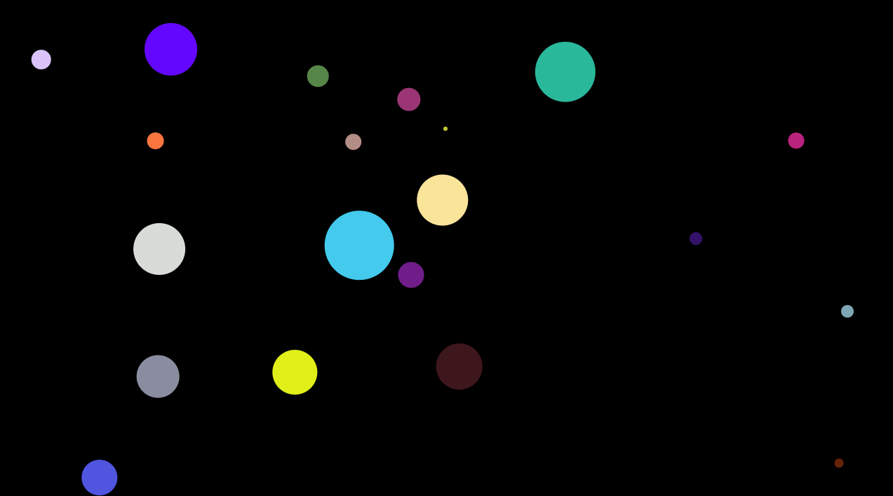

# Web Particle Simulator

A simple 2d particle simulator rendered in HTML canvas

## [Live Demo](https://kp-particle-simulator.netlify.app/)

## Preview

## Development

- clone this repo
- install npm packages - `yarn`
- run locally - `yarn start`

## License

- MIT
